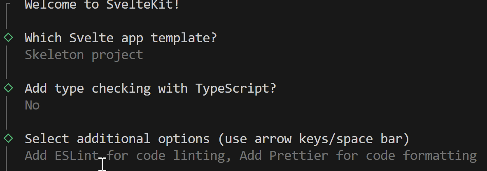

# svelte-kauppalista2024
Kauppalista koodattuna SvelteKitilla ja Pocketbase taustajärjestelmällä

1.Luodaan varsinainen projekti

Terminaali ikkuna
* `npm --help`
* tarkistetaan onko asennettu node, muuten asennetaan https://nodejs.org/en.
* Tulee "Tools for Node.js Native modules Installation Script" ikkuna. 
* Paina `Enter`
* Asennuksen jälkeen taas `Enter`
* Tarkista `npm --help`, `npm -v` 
* Voidaan uusittaa versio `npm install -g npm@latest`
* Jos halutaan uusuttaa node version `nvm install 20` => `nvm install [version.number]`
* `npm create svelte@latest kauppalista`, `Enter` => Y
* Tulee lisää kysymyksiä, liikkuu nuolinappaimen kanssa 
- Valitse Skeleton project
- jos ei halua TypeScript, valitse No
- Valitse `Add Eslint ...`sekä `Add Pretter for code formating`, `space` nappaimilla

Terminaalin seuraavat ajetaan komennot:

1: `cd kauppalista`
2: `npm install`
3: `git init` && `git add -A` && `git commit -m "Initial commit" `(optional)
4: `npm run dev -- --open`

2. prettierrc tiedostoon:

{
    
    "useTabs": false,
    "tabWidth": 4,
    "singleQuote": true,
    "trailingComma": "es5",
    "printWidth": 79,
    "proseWrap": "always", // voi siirtää pitkät rivit alaspäin
    "bracketSpacing": false,
    "plugins": ["prettier-plugin-svelte"],
    "overrides": [{"files": "*.svelte", "options": {"parser": "svelte"}}]
}

* Aja `npx prettier -w .`

- Voidaan ajata `npm run` => `npm run format`=> `npm run dev`

(* Esimerkkija otettu https://learn.svelte.dev/tutorial/each-blocks)

Unicode-Nr. 	HTML-Code 	Zeichen 	Offizieller Name 	Beschreibung

U+00058 (88) 	&#x00058;, X 	X 	LATIN CAPITAL LETTER X 	Großer Buchstabe X
U+237B (9083) 	&#x237B; 	⍻ 	NOT CHECK MARK 	Durchgestrichenes Häkchen
U+2573 (9587) 	&#x2573; 	╳ 	LIGHT DIAGONAL CROSS 	Dünnes diagonales Kreuz
U+25A1 (9633) 	&#x25A1;, 
                &square; 	□ 	WHITE SQUARE 	Weißes Quadrat
U+25A2 (9634) 	&#x25A2; 	▢ 	WHITE SQUARE WITH ROUNDED CORNERS 	abgerundetes Quadrat
U+25FB (9723) 	&#x25FB; 	◻ 	WHITE MEDIUM SQUARE 	mittleres Kästchen
U+2610 (9744) 	&#x2610; 	☐ 	BALLOT BOX (1) 	Kästchen (für Wahl, Stimmzettel)
U+2611 (9745) 	&#x2611; 	☑ 	BALLOT BOX WITH CHECK (1) 	Abgehaktes Kästchen
U+2612 (9746) 	&#x2612; 	☒ 	BALLOT BOX WITH X (1) 	Angekreuztes Kästchen
U+2613 (9747) 	&#x2613; 	☓ 	SALTIRE 	Andreaskreuz
U+26DD (9949) 	&#x26DD; 	⛝ 	SQUARED SALTIRE (2) 	Quadrat-Andreaskreuz
U+26F6 (9974) 	&#x26F6; 	⛶ 	SQUARE FOUR CORNERS (2) 	abgerundete Quadratecken
U+2705 (9989) 	&#x2705; 	✅ 	WHITE HEAVY CHECK MARK 	Weißes fettes Häkchen
U+2713 (10003) 	&#x2713;, 
                &check; 	✓ 	CHECK MARK 	Häkchen
U+2714 (10004) 	&#x2714; 	✔ 	HEAVY CHECK MARK 	Fettes Häkchen
U+2715 (10005) 	&#x2715; 	✕ 	MULTIPLICATION X 	Kreuzchen als Malzeichen für Multiplikation
U+2716 (10006) 	&#x2716; 	✖ 	HEAVY MULTIPLICATION X 	fettes Kreuzchen als Malzeichen
U+2717 (10007) 	&#x2717;, 
                &cross; 	✗ 	BALLOT X 	Kreuzchen (wörtl. „Wahlkästchen-X“)
U+2718 (10008) 	&#x2718; 	✘ 	HEAVY BALLOT X 	Fettes Kreuzchen
U+274C (10060) 	&#x274C; 	❌ 	CROSS MARK 	Kreuzzeichen
U+274E (10062) 	&#x274E; 	❎ 	NEGATIVE SQUARED CROSS MARK 	Negatives Kreuzzeichen im Quadrat
U+274F (10063) 	&#x274F; 	❏ 	LOWER RIGHT DROP-SHADOWED WHITE SQUARE 	Weißes Quadrat unten rechts abgetrennt schattiert
U+2A2f (10799) 	&#x2A2f;, 
                &Cross; 	⨯ 	BALLOT X 	Kreuzchen (wörtl. „Wahlkästchen-X“)
U+1F5F8 (128504) 	&#x1F5F8; 	🗸 	LIGHT CHECK MARK (1,2) 	Dünnes Häkchen
U+1F5F9 (128505) 	&#x1F5F9; 	🗹 	BALLOT BOX WITH BOLD CHECK (1,2) 	Fett abgehaktes Kästchen
U+1F7AC (128940) 	&#x1F7AC; 	🞬 	HEAVY SALTIRE (1,2) 	Fettes Andreaskreuz

